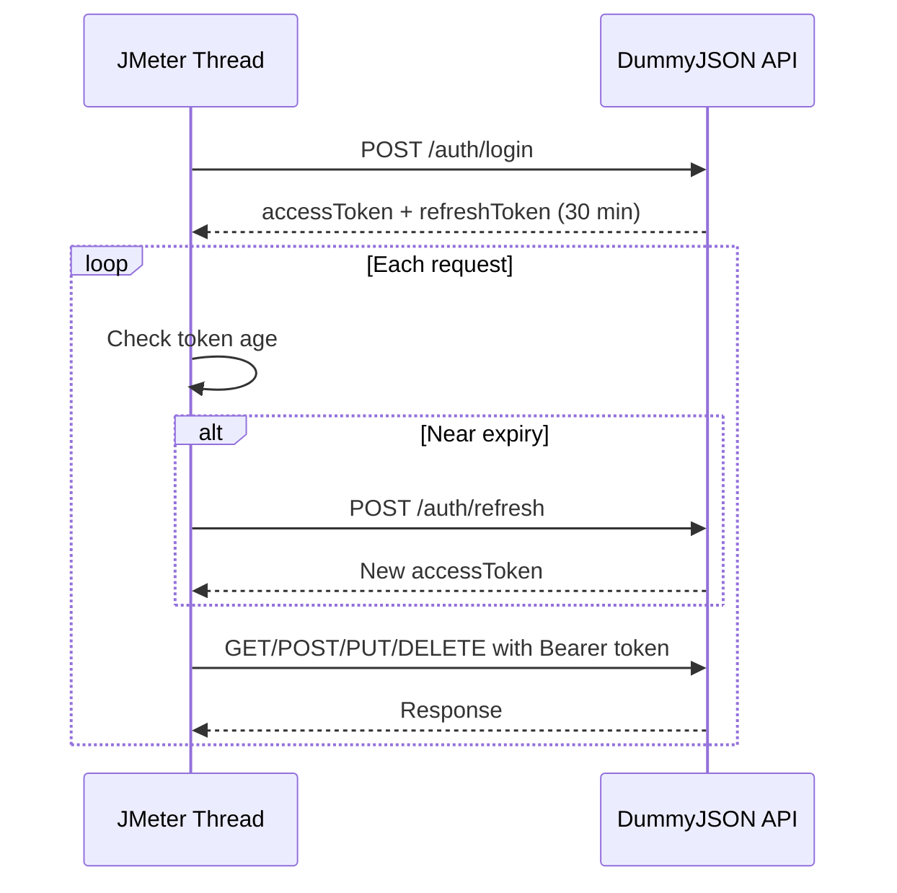

# jmeter-perf-lab

I built this to actually learn JMeter properly, not just read about it. It's a performance testing lab against a live REST API, focused on one problem that most tutorials skip: what happens when your auth token expires in the middle of a test run.

## Skills demonstrated

- REST API testing across GET, POST, PUT, DELETE
- JWT-based authentication and token lifecycle management
- Automatic token refresh under load, without request failures
- Root-cause debugging of auth behavior (see "Engineering decisions" below)
- Thread-scoped variable design for realistic multi-user simulation
- JMeter test plan structuring: Logic Controllers, Header Managers, JSON Extractors

## What this covers

- GET, POST, PUT, and DELETE requests against a real API (DummyJSON)
- Logging in and extracting a JWT access token and refresh token
- Detecting when the token is close to expiring and refreshing it automatically, mid-test, without the test failing
- A basic system check script to confirm Java, JMeter, and Git are installed before running anything

## Why DummyJSON

It's free, needs no API key, and has a real login/refresh token flow instead of a fake one. That made it possible to test the actual expiry-and-refresh problem instead of simulating it.

## Engineering decisions

**Why no HTTP Cookie Manager.** DummyJSON sets tokens as cookies in addition to returning them in the response body. Any client that honors `Set-Cookie` — including JMeter's Cookie Manager — will silently authenticate requests via cookies even if the Bearer token logic is broken. I found this the hard way while testing manually in Insomnia: removing the token from the Auth tab still returned authenticated data, because the cookie jar was carrying it invisibly. This test plan uses Bearer headers only, deliberately, so a passing request actually proves the token logic works.

**Reactive vs. proactive refresh.** A reactive approach — refresh only after a 401 — is simpler but means every thread has to fail once before self-correcting, which isn't how a real client behaves. This lab implements proactive refresh: each thread tracks its own login timestamp and refreshes ahead of the token's expiry, so the test never shows a failed request due to auth. That distinction is the actual point of this repo.

## Token refresh flow

## Structure

- `system-check/` — script to verify Java, JMeter, and Git are installed
- `test-plans/` — the JMeter .jmx files
- `data/` — CSV files for running the test with multiple users
- `docs/` — notes on how the token refresh logic works and why
- `results/` — test output, not committed except a placeholder

## Status

Still building this piece by piece. Right now the login flow and token extraction are working. Automatic refresh under load is next.

## Author

Shrawan — SDET/QA automation engineer, 10+ years in enterprise test automation and performance testing.
[LinkedIn](https://www.linkedin.com/in/sravanyenumula/) · [GitHub](https://github.com/ShrawanXIO)